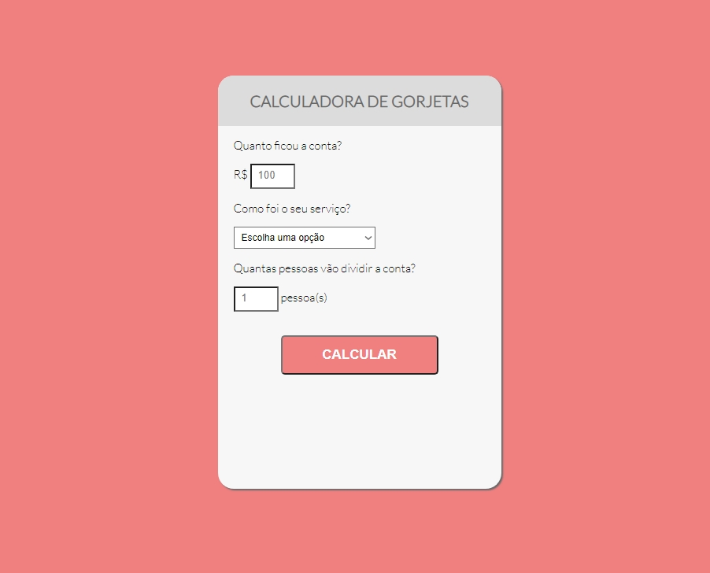

<h1 align="center">
    
</h1>

  :white_check_mark: <a href="https://andreadcsousa.github.io/onebitcode_calculadora/" target="_blank">Veja a página</a>&nbsp;&nbsp;&nbsp;|&nbsp;&nbsp;&nbsp;
  :white_check_mark: <a href="https://onebitcode.com/" target="_blank">Conheça o OneBitCode</a>

# :computer: Projeto
 
- Idealizador: OneBitCode
- Projeto: Domine a base da web
- Lado da força: Front-End
- Tipo: Aulas gravadas
- Etapa: Minicurso de entrada

# :clipboard: Apresentação

O minicurso `Domine a base da web`, passa pelo básico do front-end com:

- <em>Entendendo o HTML 5</em>: HTML é a base para criarmos páginas Web. Nessa aula você vai aprender quais são seus principais elementos e como criar um projeto prático com ele.

- <em>Entendendo o CSS 3</em>: O CSS é o que nos permite deixar nossas páginas bonitas e mais funcionais. Nessa aula você vai aprender a base do CSS e como estilizar o nosso projeto prático.

- <em>Entendendo o JS</em>: Com o JavaScript nós conseguimos deixar nossas páginas dinâmicas (reagindo ao que o usuário digita, a posição do mouse e etc).

# :rocket: Tecnologias

Esse projeto foi desenvolvido com:

# :art: Layout

